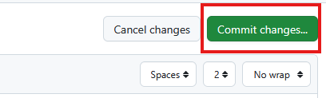
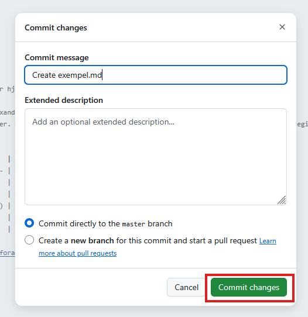
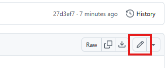

# Nyheter

Mappen `\src\content\pages\nyheter` är där alla nyheter bor.

## Lathund

### Jag vill lägga upp en nyhet

1.  Se till att du står i [mappen nyheter](). (Den mappen där du läser detta.)
2.  Högt upp till höger hittar du knappen _Add file_. Tryck på den.
    
3.  I menyn som fälls ut, tryck på _Create new file_.
    
4.  Nu ska du ha fått upp en yta där du kan skriva in texten till filen. Ovanför
    den ser du en ruta där du skriver in namnet på filen. Välj ett beskrivande
    namn, och glöm inte att ha med filändelsen `.md`.
    
5.  Kopiera och fyll i den här mallen:

    ```
    ---
    title:
    puff:
    expires:
    date:
    img:
    ---

    [Ditt innehåll]
    ```

    - `title`: Det här är rubriken på nyheten. Den kommer synas överst på
      nyhetens egna sida, men också synas på https://www.gnosjomk.se/nyheter och
      i nyhets-sektionen på startsidan.
    - `puff`: En kort text som kompletterar rubriken. Bör inte vara mer än en
      mening.
    - `expires`: Det datum då nyheten inte längre ska visas på hemsidan. T.ex.,
      om nyheten gäller ett evenemang som äger rum 2025-09-29, bör sättas till
      dagen efter, alltså 2025-09-30. **Det är viktigt att datumet har just det
      formatet: 20205-09-30.** Detta fält kan lämnas blankt, men då kommer
      nyheten aldrig att försvinna av sig självt.
    - `date`: Om nyheten är associerat med ett visst datum anger du det här. Det
      används för att nyheter om saker i närtid ska visas högre än om saker som
      äger rum längre bort i tid. Om din nyhet inte har en exakt förankring i
      tid kan du ta ett ungefärligt datum för att det ska hamna i en logisk
      kronologisk ordning med de andra nyheterna - det kommer inte att skrivas
      ut på hemsidan.
    - `img`: Filnamnet (inklusive filändelse) på den bild som ska användas på
      https://www.gnosjomk.se/nyheter och i nyhets-sektionen på startsidan.
      Bilden måste ligga i mappen [src/content/images](../../images/).

6.  Ersätt därefter "[Ditt innehåll]" med ditt innehåll. **Obs!** Nyheten kommer
    automatiskt att få som rubrik det du angett i fältet `title`. Däremot
    behöver du själv länka till bilden, om du vill ha den på nyhetens egen sida.
    Du hittar mer info om hur du skriver i markdown-format
    [här](../../../../README.md#markdown).
7.  Högt upp till höger hittar du knappen _Commit changes_. Tryck på den.
    
8.  I rutan som kommer upp, tryck på _Commit
    changes_.
9.  Vänta ett par minuter medan hemsidan byggs om. Verifiera därefter att allt
    ser bra ut. Verifiera...
    1. ...nyhetssektionen på startsidan.
    2. ...nyhetssidan.
    3. ...nyhetens egen sida.
10. Om allt ser bra ut är du nu färdig. Om något behöver ändras, se
    [guiden om hur du redigerar en nyhet](#jag-vill-redigera-en-nyhet).

### Jag vill redigera en nyhet

1. Gå till filen du vill redigera, till exempel
   `src/content/pages/nyheter/exempel.md`.
2. Högt upp till höger hittar du en knapp med en penna. Tryck på den.
   
3. Nu får du upp en yta där du kan redigera filen. Härifrån kan du följa stegen
   i [guiden om hur du lägger upp en ny nyhet](#jag-vill-lägga-upp-en-nyhet)
   från steg 4.

## Struktur

<!-- TODO expandera -->

- index.njk beskriver gnosjomk.se/nyheter
- Varje .md-fil är en nyhet
  - Frontmatter
  - Innehåll
