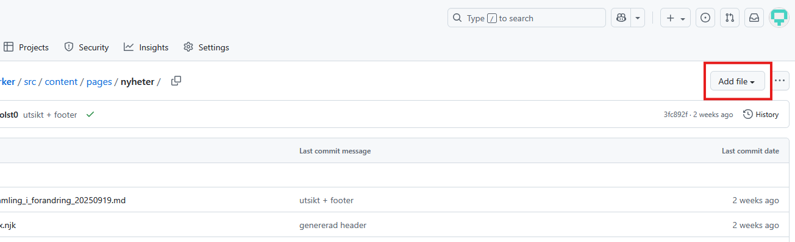
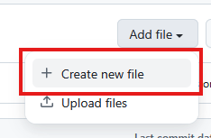
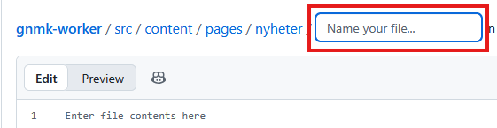

# Nyheter

Mappen `\src\content\pages\nyheter` är där alla nyheter bor.

# Lathund

## Jag vill lägga upp en nyhet

1. Skapa en ny [markdown](../../../../README.md#markdown)-fil med ett namn som
   beskriver nyheten.

   1. Se till att du står i [mappen nyheter](). (Den mappen där du läser detta.)
   2. Högt upp till höger hittar du knappen _Add file_. Tryck på den.
      
   3. I menyn som fälls ut, tryck på _Create new file_. 
   4. Nu ska du ha fått upp en yta där du kan skriva in texten till filen.
      Ovanför den ser du en ruta där du skriver in namnet på filen. Välj ett
      beskrivande namn. 
   5. Kopiera och fyll i den här mallen:

      ```
      ---
      title:
      puff:
      expires:
      date:
      img:
      ---

      [Ditt innehå]
      ```

      - `title`: Det här är rubriken på nyheten. Den kommer synas överst på
        nyhetens egna sida, men också synas på https://www.gnosjomk.se/nyheter
        och i nyhets-sektionen på startsidan.
      - `puff`: En kort text som kompletterar rubriken. Bör inte vara mer än en
        mening.
      - `expires`: Det datum då nyheten inte längre ska visas på hemsidan.
        T.ex., om nyheten gäller ett evenemang som äger rum 2025-09-29, bör
        sättas till dagen efter, alltså 2025-09-30. **Det är viktigt att datumet
        har just det formatet: 20205-09-30.** Detta fält kan lämnas blankt, men
        då kommer nyheten aldrig att försvinna av sig självt.
      - `date`: Om nyheten är associerat med ett visst datum anger du det här.
        Det används för att nyheter om saker i närtid ska visas högre än om
        saker som äger rum längre bort i tid. Om din nyhet inte har en exakt
        förankring i tid kan du ta ett ungefärligt datum för att det ska hamna i
        en logisk kronologisk ordning med de andra nyheterna - det kommer inte
        att skrivas ut på hemsidan.
      - `img`: <!-- TODO -->

   6. Nästa steg.

## Struktur

<!-- TODO expandera -->

- index.njk beskriver gnosjomk.se/nyheter
- Varje .md-fil är en nyhet
  - Frontmatter
  - Innehåll
